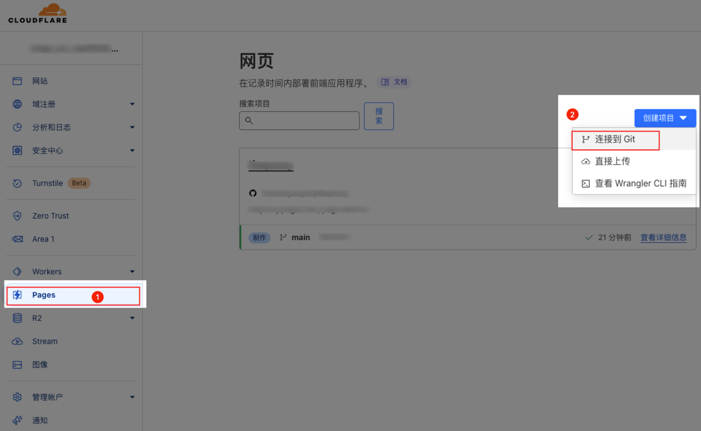
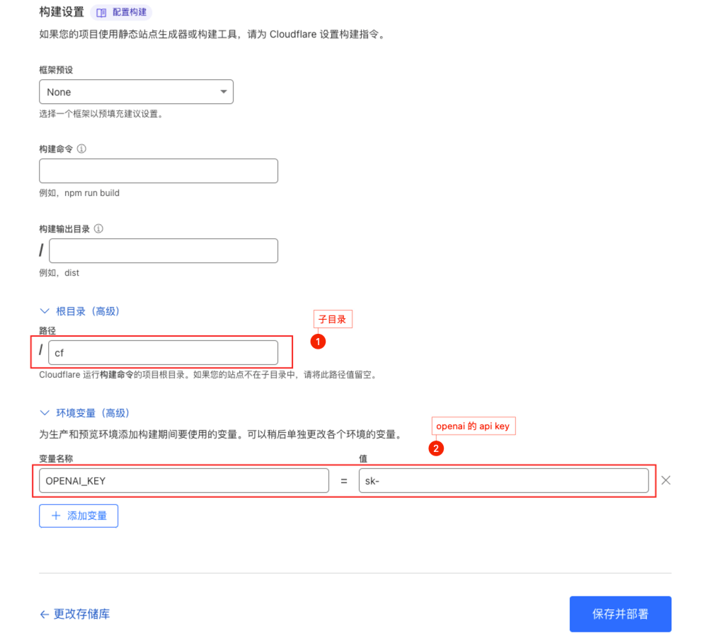
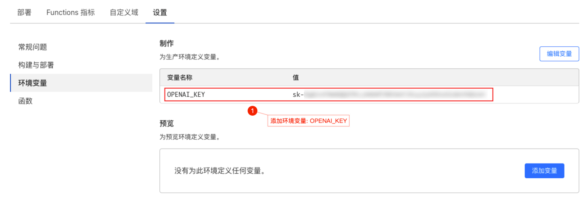

# chatGPT proxy

## 使用 CloudFlare Pages 进行中转

> 参考: https://github.com/x-dr/chatgptProxyAPI/blob/main/README.md

这里将 openai api key 放到了代理端，所以实际请求中不需要再带 key 了

### 部署

1. Github 克隆当前项目
1. 登录到 [Cloudflare](https://dash.cloudflare.com/) 控制台，右上角语言选择 `"简体中文"`
1. 在帐户主页中，选择 `Pages`> `创建项目` > `连接到 Git`
   

1. 选择你 Fork 的项目存储库，在 `设置构建和部署` 部分中，

   - 选择 `None` 作为您的框架预设;
   - 根目录设置为 `/cf`;
   - 环境变量添加 `OPENAI_KEY` 并填入自己的 key;
     其他配置保持默认即可

   

1. 点击 `保存并部署` 进行部署

1. 然后点 `继续处理项目` 即可看到访问域名

> 后续环境变量可以在项目设置中修改
> 
